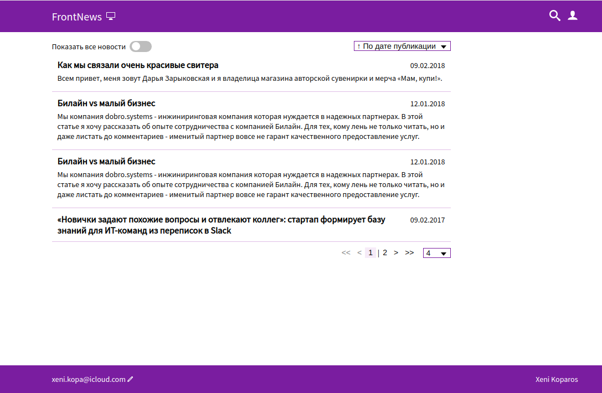

# Angular Test News project

Simple news list with:
- handmade design in Figma
- read news from JSON
- pagination
- delete, update functions for admins
- sorting
- [wrapper for material component](src/app/shared/confirm-modal/), [material components](src/app/core/notification/notification.service.ts)
- working tests of components, [backend-service](src/app/core/backend/news/news-backend.service.spec.ts)
- [dynamic render](src/app/modules/news/news.service.ts)

Stack:
- Angular 9
- SASS
- Material components

[Mockups for develop](https://github.com/xenikopa/angular-test-news/tree/master/src/assets/mockups)



## Installation

Install with [npm](http://www.npmjs.com/):

```sh
$ npm install
```
or with [yarn](https://yarnpkg.com/)
```sh
$ yarn install
```

## Developing

Run develop with command

>`npm start`

Navigate to `http://localhost:4200/`.

Get prod builded files with command
>`npm run build:prod`

Run test with command

>`npm run test`

Run linter and fix all with command

>`npm run lint:fix`
